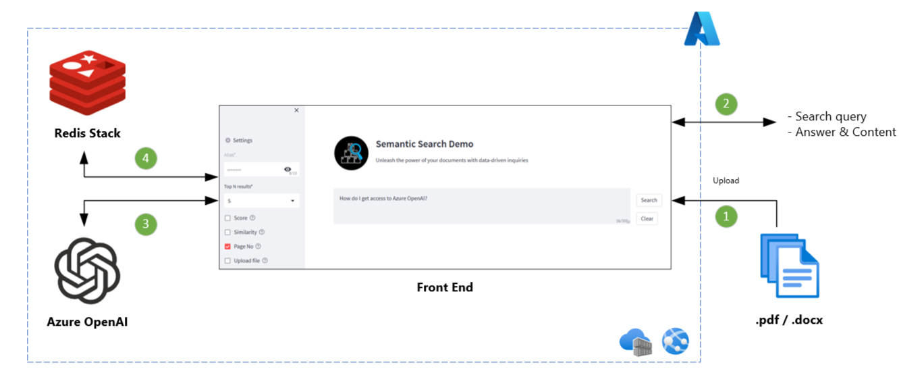

# Azure OpenAI Semantic Search Demo | Document Upload

## About

The ability to conduct semantic search on vector data is a powerful feature that allows you to find relevant content based on a specific query. This demo is helpful for showcasing and comprehending the abstract responses generated from your own data in PDF or Word format.

This solution is built on inspiration from existing Chat GPT and Document Q&A demos, however it uses a simplified architecture pattern and offers following features.

## Features
- Simplified architecture
- Built-in document cracking (.pdf, .docx)
- Upload own document and ask questions

## How to deploy?
**Run locally from Visual Studio Code or command line**
- Open VS Code terminal.
- Clone this repository and open in VS Code
- Create a new conda environment
- Navigate to misc disrectory and run _pip install -r requirements.txt_
- Provision Azure OpenAI service
    - Under deployments within Azure OpenAI Studio, deploy 2 models
    - Model for text search e.g. text-search-davinci-doc-001
    - Model for text generation e.g. text-davinci-003
- Open modules/utilities.py file and scroll to very bottom
    - Update value for "deployment_name" tag for respective model version.
- If you have used the 2 models mentioned in steps above, no changes are required in app/app.py file.
    - Otherwise, update values for aoai_embedding_model and aoai_text_model variables at the begining of app/app.py file.
- Provision Redis stack as Azure Container Instance
    - Use image = redis/redis-stack-server:latest
    - On advanced tab make sure you add
        - --requirepass <your_redis_pwd>
    - Alternatively, you may run the Redis stack in local docker environment. In this case, you do not require to provision it as ACI service.
- Almost there. Create .env file within same directory as this readme.md file and add below keys. Replace placeholders with correct values.
    - OPENAI_API_TYPE=azure
    - OPENAI_API_KEY=<YOUR_AOAI_KEY>
    - OPENAI_API_BASE=https://<YOUR_AOAI_SERVICE_NAME>.openai.azure.com
    - API_VERSION=2022-12-01
    - REDIS_HOST=<REDIS_HOST_URL>
    - REDIS_ACCESS_KEY=<REDIS_PWD>
    - REDIS_PORT=<REDIS_PORT>
- Navigate to /app directory and run following command from VS Code terminal. This will open the App UI in a browser window.
    - streamlit run app.py

**To Azure**
- More info will be added soon.

## Other important information
- [Create a resource and deploy a model using Azure OpenAI](https://learn.microsoft.com/en-us/azure/cognitive-services/openai/how-to/create-resource)
- [Quickstart: Deploy a container instance in Azure using the Azure portal](https://learn.microsoft.com/en-us/azure/container-instances/container-instances-quickstart-portal)